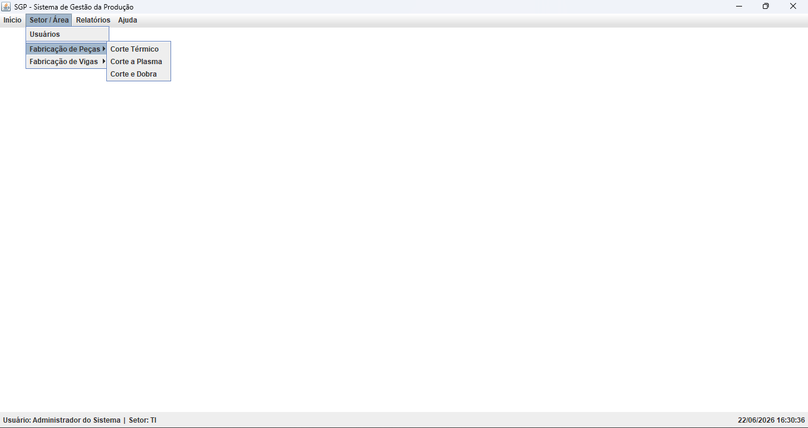

# SGP — Sistema de Gestão da Produção

[](https://opensource.org/licenses/MIT)
[](https://www.oracle.com/java/technologies/java8.html)
[]()
[]()

Sistema desktop desenvolvido em Java para apoio ao controle de produção industrial, com foco em apontamentos de setores como Corte Térmico e Corte a Plasma.

> Projeto pessoal de estudo — unindo teoria e prática no desenvolvimento de software com Java Swing.

---

## 📸 Screenshots

### Tela de Login


### Tela Principal


---

## 🚀 Funcionalidades

- 🔐 **Autenticação** com hash SHA-256 e troca obrigatória de senha no primeiro acesso
- 👥 **Gestão de Usuários** — cadastro, edição, reset de senha
- 🏭 **Controle de Acesso** por perfil (`ADMIN`, `GESTOR`, `USER`) e setor
- ⚙️ **Corte Térmico** — busca de pedidos, cadastro e edição de apontamentos
- ⚡ **Corte a Plasma** — busca, geração de data de corte, cadastro de apontamentos com rack
- 🔄 **Logout com restart** — retorna à tela de login sem fechar o programa
- 🕐 **Barra de status** com usuário logado, setor e relógio em tempo real

---

## 🛠️ Stack Tecnológica

| Componente | Tecnologia |
|------------|-----------|
| Linguagem | Java 8 |
| Interface | Java Swing (MDI) |
| Build | Maven 3 |
| Banco de Dados | Microsoft Access (`.accdb`) |
| Driver JDBC | UCanAccess 5.0.1 |
| IDE | Eclipse |

---

## 📁 Estrutura do Projeto

```
src/main/java/br/com/sgp/
├── auth/           # Login e autenticação
├── context/        # Estado temporário em memória (ThermalCuttingMemory)
├── controller/     # Lógica de apresentação e eventos
├── dao/            # Acesso ao banco de dados
├── model/          # POJOs de domínio (User, Order)
├── service/        # Lógica de negócio (ThermalCuttingRefGenerator)
├── session/        # Sessão do usuário logado (Singleton)
├── util/           # Utilitários (ConnectionFactory, PasswordUtil, AccessControl, AppRestarter)
└── view/           # Telas Swing
    ├── sector/     # Views dos setores de produção
    └── ...
```

---

## ▶️ Como Executar

### Pré-requisitos

- Java 8 instalado
- Microsoft Access instalado (para abrir/editar o banco)
- Eclipse IDE (para desenvolvimento)

### Pelo Eclipse

1. Clone o repositório:
```bash
git clone https://github.com/edivan-car/projetoSGP.git
```

2. Importe o projeto no Eclipse:
   - `File → Import → Existing Maven Projects`
   - Selecione a pasta clonada

3. Copie o arquivo de exemplo para criar sua configuração local:

```text
config.properties.example → config.properties
```

4. Configure em `config.properties` o caminho do banco de dados:

```properties
db.path=C:/caminho/para/db_production.accdb
```

Também são aceitos caminhos de rede e caminhos relativos ao diretório da aplicação.

5. Execute a classe `Main.java` como Java Application

---

### Gerando o JAR para produção

```bash
mvn clean package
```

O arquivo gerado estará em:
```
target/sgp-1.0.0-SNAPSHOT-jar-with-dependencies.jar
```

### Estrutura de distribuição

```text
SGP/
├── sgp-1.0.0-SNAPSHOT-jar-with-dependencies.jar
└── config.properties
```

Exemplo de `config.properties` apontando para um banco em rede:

```properties
db.path=//SERVIDOR/Producao/db_production.accdb
```

O caminho do banco pode ser alterado sem recompilar o sistema.

Execute com:
```bash
java -jar sgp-1.0.0-SNAPSHOT-jar-with-dependencies.jar
```

---

## 🔐 Controle de Acesso

| Perfil | Acesso |
|--------|--------|
| `ADMIN` | Tudo — gestão de usuários e todos os setores |
| `GESTOR` | Rotinas do setor + Relatórios |
| `USER` | Apenas rotinas do setor cadastrado |

| Setor | Valor no banco |
|-------|---------------|
| Fabricação de Peças | `FABRICACAO_PECAS` |
| Fabricação de Vigas | `FABRICACAO_VIGAS` |
| TI | `TI` |

---

## 🔒 Segurança

- Senhas armazenadas com hash **SHA-256**
- Troca obrigatória de senha no **primeiro acesso**
- Senha genérica de reset: definida internamente pelo administrador
- Menus ocultados conforme perfil e setor do usuário

---

## 📌 Roadmap

- [ ] Módulo Corte e Dobra
- [ ] Módulo Fabricação de Vigas
- [ ] Relatórios por setor
- [ ] Tabela de setores dinâmica
- [ ] Logs centralizados
- [ ] Configuração externa via `config.properties`
- [ ] Testes unitários

---

## 📄 Licença

Distribuído sob a licença MIT. Veja [LICENSE](LICENSE) para mais informações.

---

## 👨‍💻 Autor

**Edivan Cardoso**

Projeto desenvolvido para fins de estudo e aprendizado prático em desenvolvimento de software com Java.
